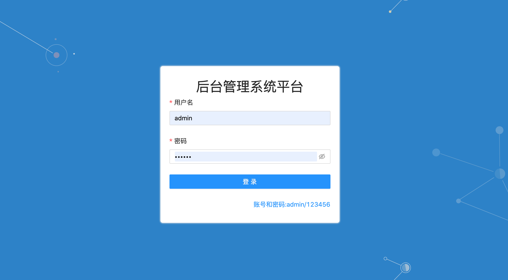
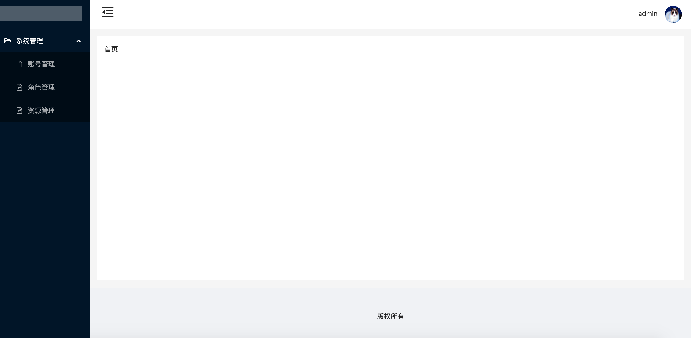
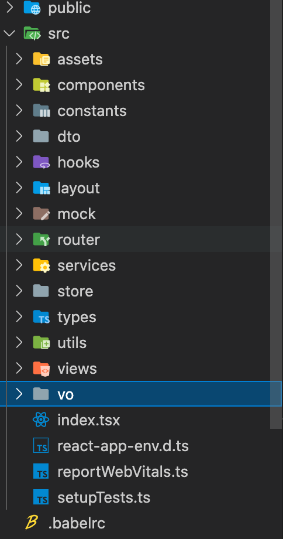

## 一、项目介绍

本项目是使用`react17+typescript+antd`搭建的后台管理系统模板，主要用于企业后台管理系统，使用`@reduxjs/toolkit`做数据管理，搭载了最新的`router-v6`，项目中引入了后端接口，[后端项目地址](https://github.com/kuangshp/nestjs-mysql-api)






## 二、项目目录结构说明



## 三、项目运行

* 1、下载项目

  ```properties
  git clone https://github.com/kuangshp/react-admin-web.git
  ```

* 2、安装依赖包

  ```properties
  npm install
  # or
  yarn
  ```

* 3、运行后端项目

* 4、运行前端项目

  ```properties
  npm run start
  ```

  